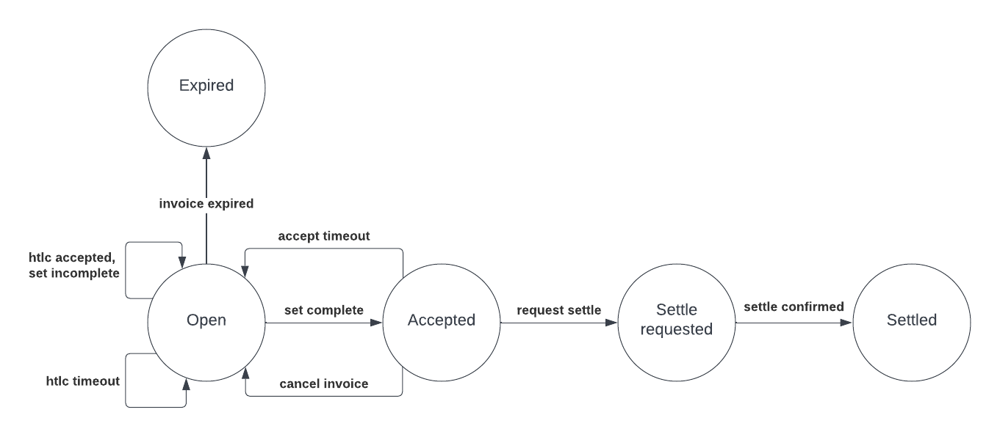

# Lightning Multiplexer

This repository contains the code for Lightning Multiplexer service, `lnmux` for short.

The problem that `lnmux` solves is fail-over for incoming Lightning payments. BOLT11 invoices are bound to a single node. If that node goes down, the invoice is no longer payable. The same is true for the node or its peers running out of inbound liquidity.

A typical solution is to set up multiple nodes. If invoice expiry durations are short and down time is planned, it is possible to gracefully spin down a node by waiting for all invoices generated by that node to reach a final state. During that time, new invoices should only be generated on the remaining nodes.

This however does not work for unexpected down time. An invoice that may have been passed on to the payer already becomes impossible to settle.

What `lnmux` allows you to do is set up a cluster of nodes where each of these nodes can settle any invoice. If a node is unable to accept payments for one of the reasons above, senders will still be able to pay the invoice via one of the other nodes.

Even with all nodes in the cluster available, it can be advantageous for the sender to have multiple routing options to better utilize liquidity and minimise fees. If needed, multi-part payments can be completed through more than one cluster node.

## Design

`lnmux` is a massively stripped down version of a full Lightning node, almost to the point that there is nothing left. It has no channels, no external network connections and it does not partake in p2p gossip. It does have its own node key for signing invoices and it is also able to decode onion packets. In this document, the term full node refers to a full Lightning node, not a full Bitcoin node.

The intended setup is a single instance of `lnmux` in conjunction with a number of full nodes.

Senders direct their payments to `lnmux` by its node key, routing through any of the full nodes. When one of the full nodes detects a payment that is to be forwarded to `lnmux`, an alternative processing flow is entered. Instead of trying to look up the outgoing channel (which doesn’t exist), the routing node contacts `lnmux` directly to obtain the preimage for this HTLC and then settles it immediately. The payment is short-circuited with the final hop being no more than a call to obtain the preimage.

If one of the full nodes goes down, senders will keep looking for alternative routes to reach `lnmux`. If full node A is down, they will try to reach `lnmux` via full node B. Full node B is also aware of `lnmux` and is therefore able to settle the payment too. This is what realises fail-over behaviour.

Because `lnmux` has no channels, it is impossible to broadcast its location in the network through Lightning P2P gossip. Senders will not know how to reach it. This is why `lnmux` invoices include route hints. Route hints describe a route from one or more publicly known nodes to the destination. In the case of the example above, there will be two route hints. One hinting a path from full node A to `lnmux` and another one hinting from full node B to `lnmux`.

It is worth noting that senders are not able to distinguish `lnmux` from any other private node.

## Implementation

Multiplexer takes over the invoice handling logic from LND completely and it has its own Postgres-based invoice database where it keeps track of the state of invoices. The invoice databases of the LND instances are no longer used.

Invoices are solely created by Multiplexer and signed with its node key. The LND nodes are not involved in the invoice creation process, other than their node keys being listed as route hints.


For the settlement of invoices, Multiplexer interfaces with LND on the HTLC level through the HTLC interceptor API. HTLCs that come in via the interceptor stream are inspected by Multiplexer. If an HTLC pays to a known invoice, a settle message containing the HTLC preimage is sent back to the node that accepted the HTLC. At that point, Multiplexer marks the invoice as settled in its database.

This mechanism works for multi-part payments too, even when the parts come in through different full nodes. Multi-part, multi-node payments allow the sender to utilise the full liquidity across all nodes for a single payment, improving reliability along a different dimension. More generally, and this also applies to single-part payments, they can choose a route through the node that is best for them and for example minimise the routing fee.

It is critically important that every HTLC is always passed on to Multiplexer for handling. This applies to both the onchain and the offchain resolution paths. Inconsistent behaviour can lead to loss of funds.

In the future, support for node implementations other than LND may be added. Using a mix of implementations further increases the resiliency of the system.

## Single point of failure

In this described setup, a full node is no longer a single point of failure for a payment. With Multiplexer though, a new single point of failure is introduced. So did we really gain anything? We think the answer to that question is yes.

The Multiplexer database itself can be replicated, so we don’t count it as being an additional single point of failure.

The logic contained in Multiplexer is limited. It tracks incoming HTLCs in memory and when a set of HTLCs is complete, the corresponding invoice in the database is marked as settled. There is far less that can go wrong compared to all the failure modes of a full Lightning node. If Multiplexer is running in a framework like Kubernetes and crashes, a new instance can be brought up automatically with minimal downtime.

One scenario that may be problematic is a bug in Multiplexer from which it cannot recover. In a more distributed setup, that bug may be present too, but may not get triggered on all instances. For the moment, we consider this an acceptable risk. But if needed, the code can be extended to support multiple instances.

## Extra Features

In addition to the functionality described above, `lnmux` offers the following extra features:

* Defining a routing policy for the virtual channels. This effectively comes down to letting the operator charge an inbound fee for payments that arrive at their cluster of nodes.

* Generated invoices are stateless. This means that invoices that are still in the open state are not stored in the database. Only once the connection application requests settlement, the invoice is written to disk. The advantage of this is that the resource footprint of an invoice is very small. An example use that would leverage this advantage is a high-traffic website that optimistically displays a lightning invoice on its home page. This avoids the typical extra click to generate an invoice leading to a better user experience.

## Running

For the setup, it is assumed that there are multiple LND nodes running with connections to the wider Lightning network and sufficient inbound liquidity. The minimally required version of lnd is v0.16.0-beta.

* Run the `lnd` nodes with the `--requireinterceptor` option. This ensures that
  HTLCs are always offered to interceptor applications eventually, even when
  there are momentary disconnects. Not running with this option can lead to
  HTLCs failing after the invoice that they pay to has been marked as settled.

* Run the `lnd` nodes with the `--store-final-htlc-resolutions` option. This
  switches on persistent storage of the final htlc resolution, which is needed
  to move an invoice in lnmux to its final state.

* Create a postgres database.

* Create a config file for `lnmuxd` named `lnmux.yml`. An [example](lnmux.yml.example) can be found in this repository. The config file contains the following elements:
  * LND nodes configuration: TLS certificate, macaroon, address and pubkey. Pubkey is configured as a protection against unintentionally connecting to the wrong node.
  * Postgres connection string for the database created above (can be overridden by the environment variable `LNMUX_PERSISTENCE_POSTGRES_DSN` to avoid exposing credentials).
  * 32-byte Identity PRIVATE key. This key is used to generate invoices and decode incoming htlcs. In a production environment, this key must be protected carefully (can be overridden by the environment variable `LNMUX_IDENTITY_KEY` to avoid exposing the private key).
  * Your logging configuration. The most important options are the logs level, the encoding format and the activation of grpc logs.

* Initialize the database: `go run ./cmd/lnmuxd -c lnmux.yml migrate init`

* Migrate the database to the latest version: `go run ./cmd/lnmuxd -c lnmux.yml migrate up`

* Run `lnmuxd`: `go run ./cmd/lnmuxd -c lnmux.yml run`. This opens connections to all LND nodes via the HTLC interceptor API. Incoming htlcs are collected and assembled into sets. When a set is complete, an external application connected to `lnmux` decides whether to settle the invoice. If the application sends a settle request, the invoice is marked as settled in the `lnmux` database and a settle action is returned to the LND instance(s) holding the HTLC(s).

* Invoice generation is taken over by `lnmuxd`. It is no longer a responsibility of the LND nodes. To generate an invoice, run:

  ```bash
  grpcurl -plaintext -v \
  -d '{"amt_msat":20000, "expiry_secs":600}' \
  localhost:9190 lnmux.Service.AddInvoice`.
  ````
  If you decode the invoice, you'll find route hints from each node in the cluster to the `lnmuxd` public key. `lnmuxd` acts as a virtual node without real channels.

  The invoice is not stored in the `lnmux` database and does not take up any disk space. This makes `lnmux` particularly suitable for scenarios where large numbers of invoices are generated.

  Below is an example invoice generated by `lnmuxd`.
  ```json
  {
      "destination": "03422175ba6fed348de4f273cf81627c26d5ab2a78bfdc1a39e6f9c06354dd9371",
      "payment_hash": "fd3b0f9a077006697ba8f82cc5673d1511cb11d1d1012662bf0c0b3c93f4245e",
      ...
      "route_hints": [
          {
              "hop_hints": [
                  {
                      "node_id": "020723c6f2203f1072336bd0e71bf4d11e367ab0b3010ce60c080abef0d4770db8",
                      "chan_id": "12345",
                      "fee_base_msat": 0,
                      "fee_proportional_millionths": 0,
                      "cltv_expiry_delta": 40
                  }
              ]
          },
          {
              "hop_hints": [
                  {
                      "node_id": "026ff75cb2ff49b864833aa3c93970069070231a9ad64819252e190406dd0a6976",
                      "chan_id": "12345",
                      "fee_base_msat": 0,
                      "fee_proportional_millionths": 0,
                      "cltv_expiry_delta": 40
                  }
              ]
          }
      ],
      "payment_addr": "8f135e331fed1858e467f775fa644751a2b0da17ee0676ebb1bc8a994d667be6",
      "num_msat": "6000",
      "features": {
          ...
      }
  }
  ```

* It should be possible to pay this invoice as long as at least one node in the cluster is available.

* When the payment comes in, an event is generated. Events can be listened for via:

  ```bash
  grpcurl -plaintext -v localhost:9190 lnmux.Service.SubscribeInvoiceAccepted
  ````

  Each time an invoice is accepted, you will receive a pair (hash , setID):

  ```json
  {
    "hash": "rCdcdDvpo7oqkO1Gkh1hikofseQpUZhgAIaw6gYXz7M=",
    "setId": "J1q7YDvixChKrJjjP/yvv16KiQdpHqwW7gy8jqxDAvI="
  }
  ```  

* To request settlement of the invoice, invoke:

  ```bash
  grpcurl -plaintext -v \
  -d '{"hash":"rCdcdDvpo7oqkO1Gkh1hikofseQpUZhgAIaw6gYXz7M=","set_id":"J1q7YDvixChKrJjjP/yvv16KiQdpHqwW7gy8jqxDAvI="}' \
  localhost:9190 lnmux.Service.SettleInvoice`
  ```

## Expected output

If you've set up `lnmuxd` correctly, output similar to what is shown below is expected.
* Interception is started on all of your nodes
* When an HTLC comes in, it is matched against the invoice database. If there is a match, the invoice is loaded into memory.
* The total amount of the HTLC set is tracked. When the total amount matches the invoice amount, HTLC settle resolutions are sent to LND.

```
2022-04-19T08:39:09.333+0200	INFO	Succesfully connected to LND	{"node": "020723c6f2203f1072336bd0e71bf4d11e367ab0b3010ce60c080abef0d4770db8"}
2022-04-19T08:39:09.339+0200	INFO	Succesfully connected to LND	{"node": "026ff75cb2ff49b864833aa3c93970069070231a9ad64819252e190406dd0a6976"}
2022-04-19T08:39:09.347+0200	INFO	InvoiceRegistry starting
2022-04-19T08:39:09.347+0200	INFO	Press ctrl-c to exit
2022-04-19T08:39:09.347+0200	DEBUG	Starting htlc interception	{"node": "026ff75cb2ff49b864833aa3c93970069070231a9ad64819252e190406dd0a6976"}
2022-04-19T08:39:09.347+0200	DEBUG	Starting htlc interception	{"node": "020723c6f2203f1072336bd0e71bf4d11e367ab0b3010ce60c080abef0d4770db8"}
2022-04-19T08:39:09.347+0200	DEBUG	Starting main event loop
2022-04-19T08:39:23.166+0200	INFO	Htlc received	{"hash": "fd3b0f9a077006697ba8f82cc5673d1511cb11d1d1012662bf0c0b3c93f4245e", "source": "026ff75cb2ff49b864833aa3c93970069070231a9ad64819252e190406dd0a6976", "circuitKey": "1161084279062528:7"}
2022-04-19T08:39:23.224+0200	DEBUG	Loaded invoice from db	{"hash": "fd3b0f9a077006697ba8f82cc5673d1511cb11d1d1012662bf0c0b3c93f4245e"}
2022-04-19T08:39:23.225+0200	DEBUG	Hodl subscribe for 1161084279062528:7
2022-04-19T08:39:23.225+0200	DEBUG	Htlc accepted: hash=fd3b0f9a077006697ba8f82cc5673d1511cb11d1d1012662bf0c0b3c93f4245e, amt=6000 mSAT, expiry=1110, circuit=1161084279062528:7, mpp=total=6000 mSAT, addr=8f135e331fed1858e467f775fa644751a2b0da17ee0676ebb1bc8a994d667be6
2022-04-19T08:39:23.237+0200	DEBUG	Sending settle resolution	{"hash": "fd3b0f9a077006697ba8f82cc5673d1511cb11d1d1012662bf0c0b3c93f4245e", "source": "026ff75cb2ff49b864833aa3c93970069070231a9ad64819252e190406dd0a6976", "circuitKey": "1161084279062528:7", "outcome": "settled"}
```

## Leader election

Lnmux is designed as a single-instance process. Running multiple instances
connected to the same database simultaneously results in incorrect behavior and
may put funds at risk.

To ensure that there can only ever be one instance running, k8s leader election
can be enabled via the `DistributedLock` config group.

## Invoice lifecycle



Note that only the states `accepted`, `settle requested` and `settled` are published to callers of the `SubscribeSingleInvoice` rpc. Lnmux isn't aware of open invoices because it is stateless.

## Docker Instructions

We provide a Dockerfile to launch lnmux using docker.

This Dockerfile will build 2 different images: one for debian and the other one for alpine.

You have 2 options to get the lnmux image:

- Either, building it by yourself: navigate to the lnmux repository and simply do:
  ```bash
  docker build -t lnmux .
  ```
  
- Or pull directly the image we pushed into ghcr.io (You can check existing images [here](https://github.com/bottlepay/lnmux/pkgs/container/lnmux/versions?filters%5Bversion_type%5D=tagged))
  ```bash
     docker pull ghcr.io/bottlepay/lnmux:{tag|sha}
  ```


**However**, we don't provide any configuration file in the Dockerfile (and don't do the migration either).
You need to provide certificates (TLS/Macaroon) as well to connect lnd nodes.

To do so, you can simply use `--mount`:

```bash
 docker run -it \
  --mount type=bind,source="$(pwd)/lnmux.yml",target=/app/lnmux.yml \
  --mount type=bind,source="$(pwd)/lnd/certs",target=/app/certs  \
  ghcr.io/bottlepay/lnmux:sha-bf41263-alpine /bin/sh -c \
  "/usr/bin/lnmuxd -c /app/lnmux.yml migrate init && \
   /usr/bin/lnmuxd -c /app/lnmux.yml migrate up && \
   /usr/bin/lnmuxd -c /app/lnmux.yml run"

```


> ⚠️ Don't forget to add **before starting nodes connected to lnmux** (aka Alice and Bob):
> - `--requireinterceptor` to make sure all htlcs are intercepted
> - `--store-final-htlc-resolutions` to make sure all htlcs are intercepted
> - `--tlsextradomain=host.docker.internal` to add docker DSN to TLS certs (otherwise you can't connect from a docker container)
>
> If your nodes are already started, you will have to stop them, remove manually tls certs and then restart them.
> 
> Furthermore, you must use `host.docker.internal` instead of `localhost` in your configuration
> (plus --add-host host.docker.internal:host-gateway for Linux users).

## Regtest testing

The minimal setup to test on regtest is to create three LND nodes Alice, Bob and Carol.
Alice and Bob should have a channel with Carol, and `lnmuxd` should be connected to Alice and Bob.

The typical workflow is:
- Create invoices using lnmux
- Carol pays the invoices
- lnmux generates accepted events and settles the invoices either through Alice or Bob.

## Experimental

This software is in an experimental state. At this stage, breaking changes can happen and may not always include a database migration. Use at your own risk.